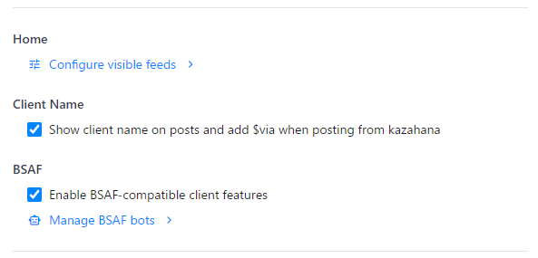
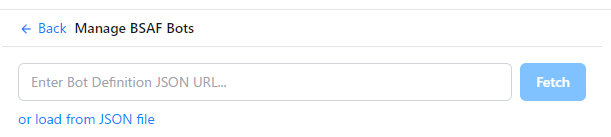
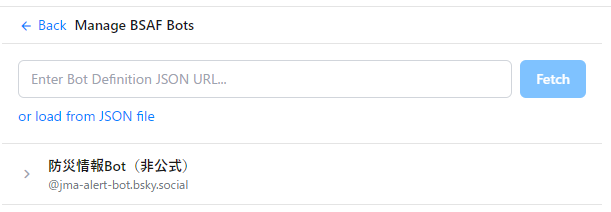

# How to Register a BSAF Bot

This guide walks you through registering a BSAF (Bluesky Structured Alert Framework) compatible bot in kazahana and configuring filters so you only receive the alerts that matter to you.

As an example, we will register **bsaf-jma-bot** ([@jma-alert-bot.bsky.social](https://bsky.app/profile/jma-alert-bot.bsky.social)), which delivers disaster information from the Japan Meteorological Agency.

## Contents

- [Prerequisites](#prerequisites)
- [Step 1: Follow the Bot](#step-1-follow-the-bsaf-bot)
- [Step 2: Obtain the Bot Definition JSON](#step-2-obtain-the-bot-definition-json)
- [Step 3: Enable BSAF](#step-3-enable-bsaf)
- [Step 4: Register the Bot Definition JSON](#step-4-register-the-bot-definition-json)
- [Step 5: Open the Filter Settings](#step-5-open-the-filter-settings)
- [Step 6: Select the Alerts You Want](#step-6-select-the-alerts-you-want)
- [Step 7: Check Your Timeline](#step-7-check-your-timeline)
- [Summary](#summary)
- [Related Links](#related-links)

---

## Prerequisites

- kazahana is installed on your computer
- You are logged in with a Bluesky account

---

## Step 1: Follow the BSAF Bot

On Bluesky, follow the account of the BSAF-compatible bot you want to register.

> **Tip:** Creating a dedicated list for BSAF bots makes them easier to manage.


---

## Step 2: Obtain the Bot Definition JSON

BSAF-compatible bots publish a **Bot Definition JSON** that contains all the information needed for filtering. To register a bot, you need one of the following:

| Method | Description |
|--------|-------------|
| **Distribution URL (recommended)** | The URL of the JSON file, typically found in the bot's README or profile |
| **JSON file** | A previously downloaded JSON file |

For bsaf-jma-bot, the Bot Definition JSON URL is:

```
https://raw.githubusercontent.com/osprey74/bsaf-jma-bot/main/bot-definition.json
```


---

## Step 3: Enable BSAF

1. Open the kazahana **Settings** screen.
2. Check the box labeled "**Enable kazahana as a BSAF-compatible client**."
3. Click the "**Manage BSAF Bots**" link that appears below the checkbox.



---

## Step 4: Register the Bot Definition JSON

The "**Manage BSAF Bots**" screen will open. Load the Bot Definition JSON using one of the following methods:

### Fetch from URL (recommended)

1. Paste the URL obtained in Step 2 into the "**Enter Bot Definition JSON URL**" field.
2. Click the "**Fetch**" button.

### Load from file

1. Click "**or load from JSON file**."
2. Select the downloaded JSON file in the file dialog that appears.



---

## Step 5: Open the Filter Settings

Once registered, the BSAF bot's **name** and **handle** appear in the list.

Click the bot's name to open its filter settings panel.



---

## Step 6: Select the Alerts You Want

The tags associated with the BSAF bot (alert types, regions, etc.) are displayed as a list.

**Select the tags for the alerts you want to receive — selected tags turn blue.** Only posts matching the selected tags will appear in your timeline.

For bsaf-jma-bot, the following tag groups are available:

| Tag group | Description | Examples |
|-----------|-------------|----------|
| **type (alert type)** | Disaster categories to receive | earthquake, tsunami, eruption, etc. |
| **value (severity)** | Minimum severity threshold | Seismic intensity 3+, 5 lower+, etc. |
| **target (region)** | Target regions to monitor | jp-hokkaido (Hokkaido), jp-kanto (Kanto), etc. |

> **Tip:** Selecting only your local region and disaster types of interest ensures you receive only the most relevant alerts.


---

## Step 7: Check Your Timeline

After completing the setup, check your kazahana **Timeline** or **List** view.

Only posts from the BSAF bot that match the filter conditions you set in Step 6 will be displayed. Posts that do not match your filters are automatically hidden.


---

## Summary

```
Follow the Bot → Obtain Bot Definition JSON → Enable BSAF
→ Register JSON → Configure Filters → Check Timeline
```

---

## Related Links

- [BSAF Protocol Specification](https://github.com/osprey74/bsaf-protocol)
- [bsaf-jma-bot Repository](https://github.com/osprey74/bsaf-jma-bot)
- [kazahana Official Site](../)
- [kazahana Repository](https://github.com/osprey74/kazahana)
