# User Guide

kazahana is a lightweight desktop client application for Bluesky. This guide explains the names and functions of each screen element.

**Supported version: kazahana v2.5.0**

## Table of Contents

- [Login](#login)
- [Basic Screen Layout](#layout)
- [Home (Timeline)](#timeline)
- [Search](#search)
- [Notifications](#notifications)
- [Direct Messages](#dm)
- [Profile](#profile)
- [New Post](#new-post)
- [Post Detail & Thread](#post-detail)
- [Settings](#settings)
- [Multi-Account](#multi-account)
- [Keyboard Shortcuts](#keyboard-shortcuts)
- [BSAF (Structured Alert Feed)](#bsaf)
- [Bookmarklet](#bookmarklet)

---

## Login

When you launch the app, the login screen is displayed.

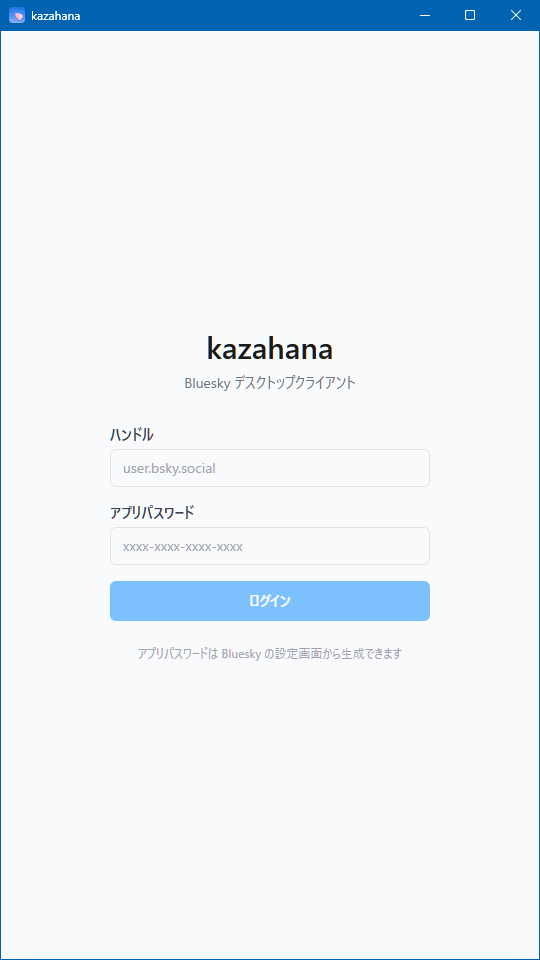

| Item | Description |
|------|-------------|
| **Handle** | Enter your Bluesky handle (e.g., `user.bsky.social`) |
| **App Password** | Enter the app password generated in Bluesky (format: `xxxx-xxxx-xxxx-xxxx`) |
| **Login button** | Logs in with the entered credentials |

The link at the bottom of the screen takes you to Bluesky's app password settings page.

> **Tip:** kazahana uses an "App Password" issued from Bluesky's settings, not your account's regular password.

---

## Basic Screen Layout

After logging in, all screens share a common layout.


### Title Bar

Displayed at the very top of the screen. It contains the app name "kazahana" and window control buttons (minimize, maximize, close).

### User Bar

| Position | Element | Description |
|----------|---------|-------------|
| Left | Reload button | Manually refreshes the timeline |
| Center | Handle display | Shows the handle of the logged-in account |
| Right | Settings icon (⚙) | Opens the [Settings screen](#settings) |

### Navigation Bar

Five icons are displayed in a row below the user bar. Clicking each icon switches to the corresponding screen.

| Icon | Screen | Description |
|------|--------|-------------|
| 🏠 | [Home](#timeline) | Displays the timeline |
| 🔍 | [Search](#search) | Search for users and posts |
| 🔔 | [Notifications](#notifications) | Displays notifications such as likes and reposts |
| ✉️ | [Direct Messages](#dm) | Displays the DM conversation list |
| 👤 | [Profile](#profile) | Displays your profile |

When there are unread direct messages, a red numbered badge appears on the ✉️ icon.

### New Post Button (FAB)

A blue circular button always displayed at the bottom right. Clicking it opens the [New Post screen](#new-post). You can also open the New Post screen by pressing the "n" key while viewing the timeline.

---

## Home (Timeline)

This screen is displayed by clicking the 🏠 icon. Posts from users you follow are displayed in chronological order.

### Feed Tabs

| Tab | Description |
|-----|-------------|
| **Home** | Displays posts from users you follow (always visible) |
| **Discover** | Displays recommended posts (visibility can be configured) |
| **Video** | Displays video posts (visibility can be configured) |

The feed tabs shown can be customized from the [Settings screen](#settings-feeds).

### Post Card

| Element | Description |
|---------|-------------|
| **Repost label** | For reposted content, "○○ reposted" is displayed at the top |
| **Avatar** | The poster's profile image. Click to open their profile |
| **Display name & handle** | The poster's display name and handle (`@xxx`) are shown |
| **Elapsed time** | Time since posting (e.g., "27m," "2h," "2d") |
| **Post body** | Text, links, hashtags, etc. |
| **Image thumbnail** | If the post contains images, thumbnails are displayed |
| **Link card** | If the post contains a URL, OGP information is displayed in card format |
| **Language label** | The post's language is shown at the bottom right (e.g., `langs: ja`) |
| **Client name** | If enabled in settings, the posting client name (e.g., `via kazahana`) is displayed |

### Action Bar

Action icons are displayed in a row at the bottom of each post card.

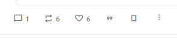

| Icon | Click action | Number | Number click action |
|------|-------------|--------|-------------------|
| 💬 Reply | Opens the reply composer | Yes | — (no list view) |
| 🔁 Repost | Immediately reposts | Yes | Displays list of users who reposted |
| ♡ Like | Toggles like on/off | Yes | Displays list of users who liked |
| "99" Quote | Displays a popup menu | — | — |
| 🔖 Bookmark | Toggles bookmark on/off | — | — |
| ⋮ Menu | Opens additional options menu | — | — |

#### Quote Popup Menu

Clicking the "99" quote icon displays the following menu.

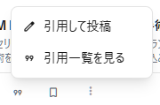

| Item | Description |
|------|-------------|
| **Quote post** | Opens the quote repost composer |
| **View quotes** | Displays a list of posts that quoted this post |

### Read Position Marker

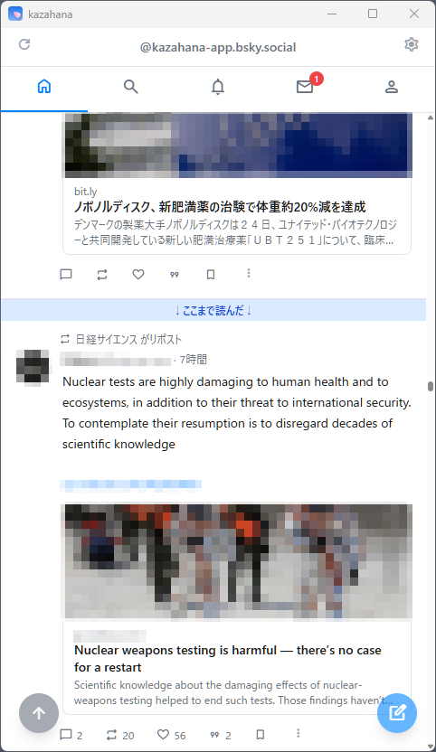

A blue horizontal bar labeled "↓Read up to here↓" is displayed on the timeline. It indicates where you last viewed, making it easy to see where you left off.

### Scroll to Top Button

When you scroll down, a blue circular button (↑ arrow icon) appears at the bottom left. Clicking it returns you to the top of the feed.

---

## Search

This screen is displayed by clicking the 🔍 icon.

### Search Initial Screen

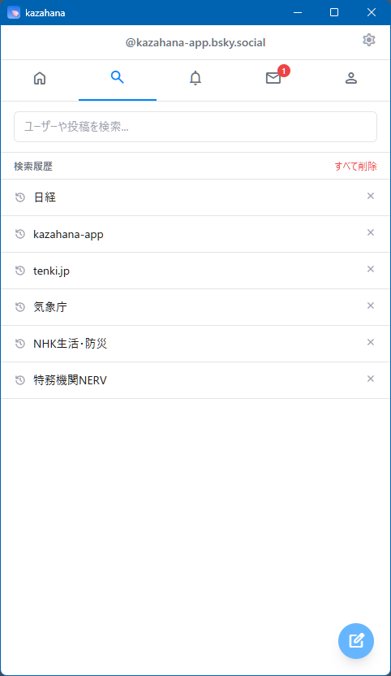

| Element | Description |
|---------|-------------|
| **Search input field** | Enter text and press Enter to search |
| **Search history** | Previously searched keywords are listed |
| **Individual delete (×)** | Each history item can be deleted with the × button |
| **Delete all** | Clears all search history at once |

### Search Results

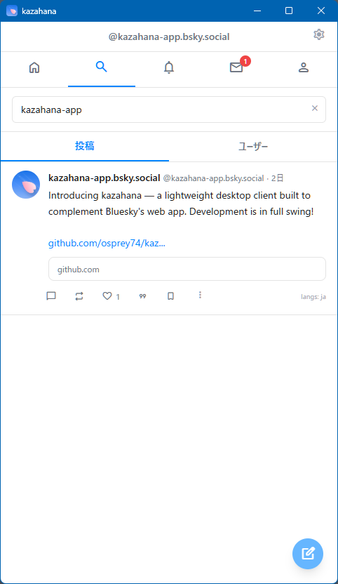

Results are displayed in two tabs: "Posts" and "Users."

| Tab | Description |
|-----|-------------|
| **Posts** | Posts matching the keyword are displayed in card format (default) |
| **Users** | Users matching the keyword are listed |

---

## Notifications

This screen is displayed by clicking the 🔔 icon.

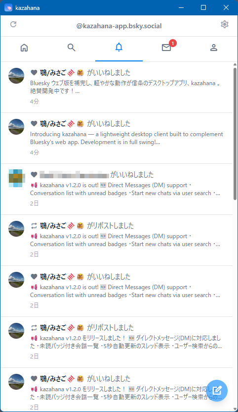

New notifications are listed in chronological order. Each includes the action type, the user who performed it, a post preview, and elapsed time.

### Notification Types

| Icon | Type | Description |
|------|------|-------------|
| ❤️ | Like | Your post was liked |
| 💬 | Reply | Your post received a reply |
| 👤 | Follow | Your account was followed |
| 🔁 | Repost | Your post was reposted |
| "99" | Quote | Your post was quote-reposted |
| @ | Mention | You were mentioned in another user's post |
| ❤️ | Like via repost | Your repost was liked |
| 🔁 | Repost via repost | Your repost was reposted |

---

## Direct Messages

This screen is displayed by clicking the ✉️ icon.

### Conversation List

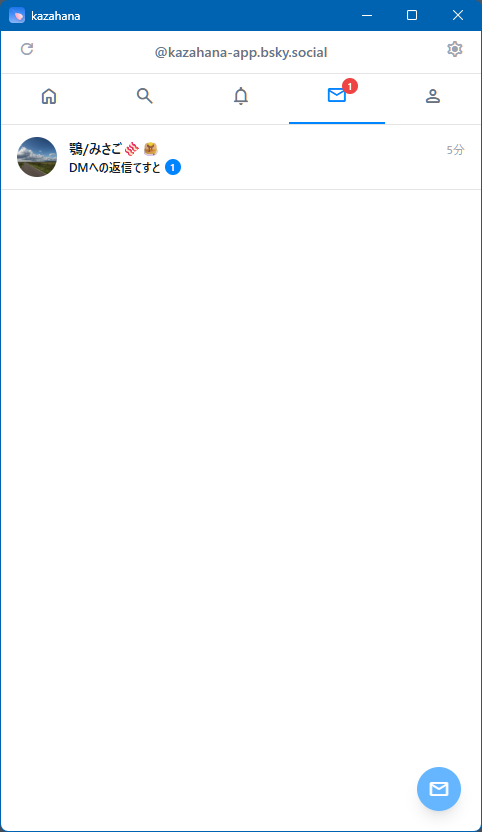

| Element | Description |
|---------|-------------|
| **Avatar & display name** | The conversation partner's profile information |
| **Latest message preview** | The beginning of the most recent message |
| **Elapsed time** | Time since the latest message |
| **Unread badge** | A green circle with the unread count |

Click a conversation to open the thread. Click the blue ✉ button at the bottom right to start a new conversation.

### Thread View


| Element | Description |
|---------|-------------|
| **← Back button** | Returns to the conversation list |
| **Partner info** | Avatar, display name, and handle |
| **⋮ Menu** | Opens additional options menu |
| **Load older messages** | Click to load older messages |
| **Message display area** | Partner's messages: left-aligned, gray. Your messages: right-aligned, blue |
| **Message input area** | Enter text and click the send button (▶) to send |

---

## Profile

Click the 👤 icon to view your own profile. Click another user's avatar or display name to view theirs.

### Your Profile

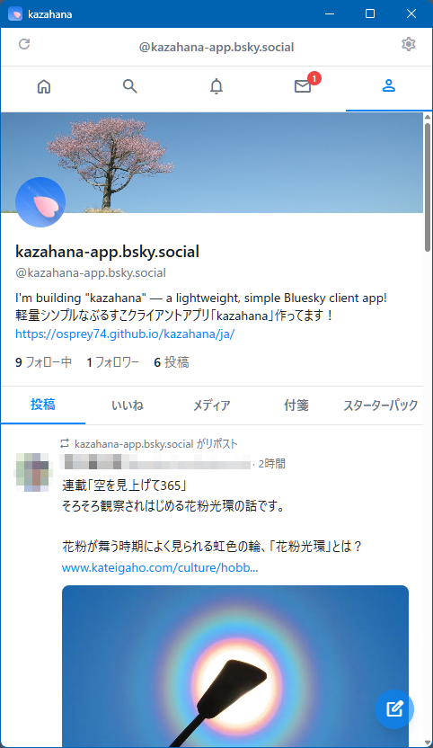

| Element | Description |
|---------|-------------|
| **Banner image** | The background image at the top |
| **Avatar** | A circular profile image |
| **Display name & handle** | The account's display name and handle |
| **Bio** | The profile's bio text and links |
| **Following** | Click to display the list of users you follow |
| **Followers** | Click to display the list of your followers |
| **Post count** | Total number of posts (not clickable) |

#### Content Tabs

| Tab | Description |
|-----|-------------|
| **Posts** | A list of your posts and reposts |
| **Replies** | A list of your replies |
| **Media** | Only posts containing images or videos |
| **Likes** | A list of posts you have liked |
| **Bookmarks** | A list of your bookmarked posts |
| **Starter Packs** | A list of starter packs you have created |

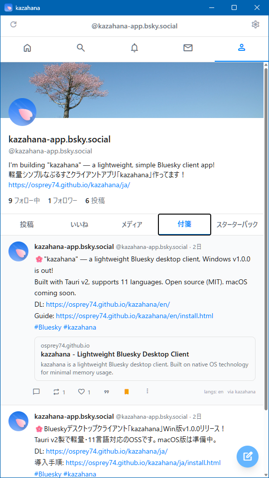

### Other Users' Profiles

A follow action button is displayed at the bottom right of the banner image.

**When not following:**

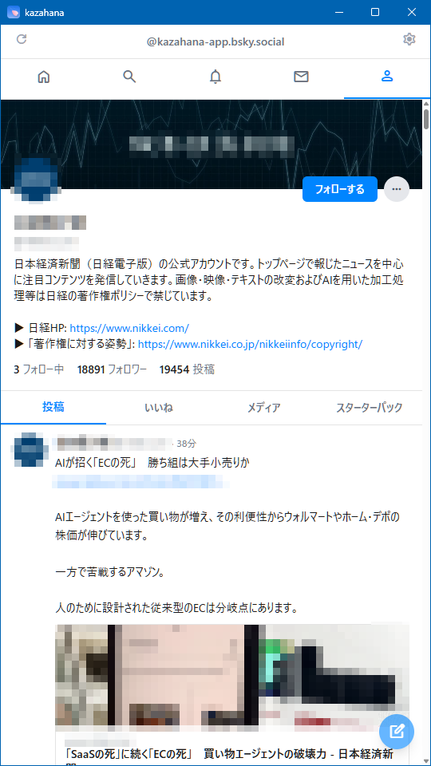

A "Follow" button (blue background) is displayed. Click to follow.

**When following:**


A "Following" button (white background) is displayed. Click to unfollow.

#### "..." Menu

| Item | Description |
|------|-------------|
| **Add/Remove from list** | Add or remove the user from a list |
| **Mute** | Mute the user |
| **Block** | Block the user |
| **Report this user** | Report the user |

> **Note:** The "Bookmarks" tab is not displayed in other users' profile content tabs.

### Following & Followers List

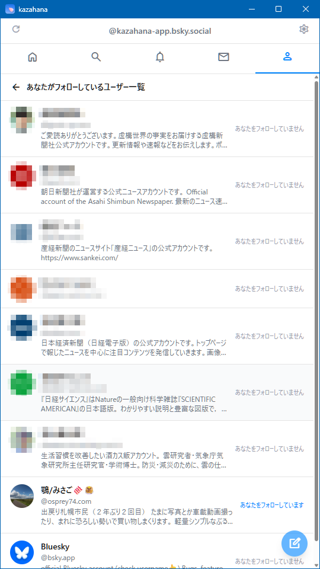
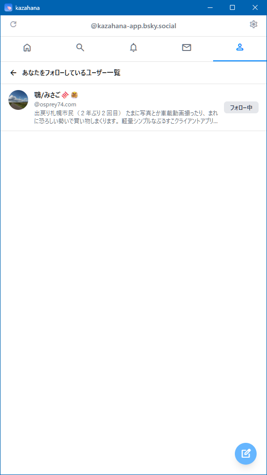

| Screen | Right-side display |
|--------|--------------------|
| **Following list** | Status label indicating whether the user follows you back |
| **Followers list** | "Following" button (if you follow them) |

---

## New Post

Clicking the FAB at the bottom right opens the post composer as a modal.

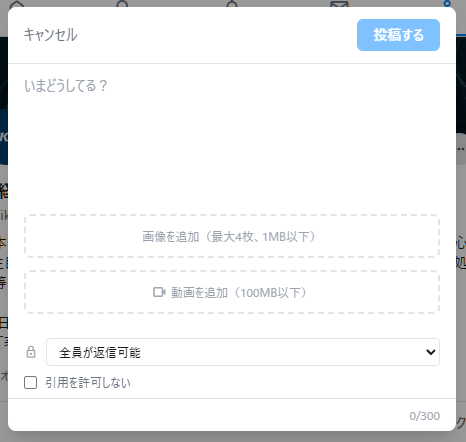

| Element | Description |
|---------|-------------|
| **Cancel** | Cancels the post and closes the modal |
| **Post button** | Publishes the post. You can also publish by pressing Alt+Enter (Windows/Linux) or Option+Enter (macOS) |
| **Text input area** | Enter your post body (placeholder: "What's up?") |
| **Character counter** | Current count and limit shown at bottom right (0/300) |
| **Add images** | Attach image files (up to 4, 1MB max each) |
| **Add video** | Attach a video file (100MB max) |
| **Reply scope** | Set who can reply via the dropdown |
| **Disable quotes** | Check to prevent quote reposts |

### Drafts

You can save unfinished posts as drafts and resume editing later.

**Saving a draft:** Click the draft icon (📝) in the compose modal header to save the current post as a draft. Up to **20 drafts** can be stored.

**Loading a draft:** Click the draft icon to open the draft list. Click any draft to load it into the composer. The draft is removed from the list after loading.

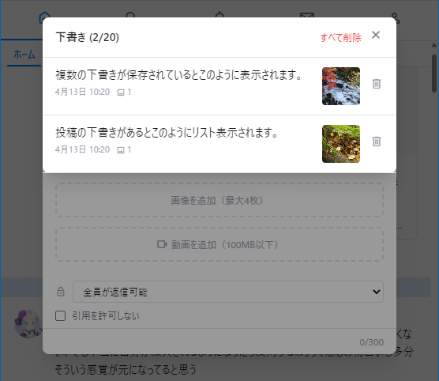

**Deleting drafts:** Each draft row has a trash icon on the right. Click it to delete that draft. To delete all drafts, click "Clear All" at the top and confirm.

> **Note:** If you have images in your draft, a quality warning may appear depending on your settings.

### Image Editing

When composing a post with images, you can edit each image before posting.

Click the edit icon on an image thumbnail in the compose modal to open the Image Editor.


**Crop modes:**

| Mode | Description |
|------|-------------|
| **Free** | Crop to any dimensions without constraints |
| **Original** | Maintain the original image's aspect ratio |
| **Square** | Lock to a 1:1 square crop |

Drag the corners or edges of the crop overlay to resize. Drag inside the crop area to reposition. A rule-of-thirds grid is shown to help with composition.

**Rotation:**

| Button | Action |
|--------|--------|
| **Rotate Left** | Rotate 90° counter-clockwise |
| **Rotate Right** | Rotate 90° clockwise |

The current rotation angle is displayed between the buttons.

Click **Apply** to save your edits, or **Cancel** to discard.

### AI Alt Text Generation

kazahana can automatically generate alt text for images using the Claude API.

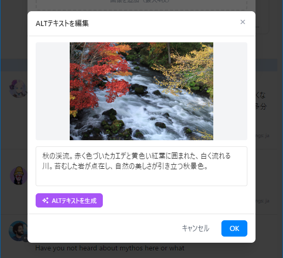

**Setup:** First, register your Claude API key in Settings (see [Claude API Key](#claude-api-key) in the Settings section).

**Generating alt text:**

1. Add an image to your post.
2. Open the Image Editor for the image.
3. Click "Edit Alt" to open the alt text dialog.
4. Click the purple **Generate** button.
5. The AI-generated description will appear in the text field.
6. Edit the text if needed, then click **OK** to save.

> **Note:** The generate button is disabled if no Claude API key is registered. The alt text is generated in your current UI language.

---

## Post Detail & Thread

Clicking a post card opens the post detail screen.

### Post Detail

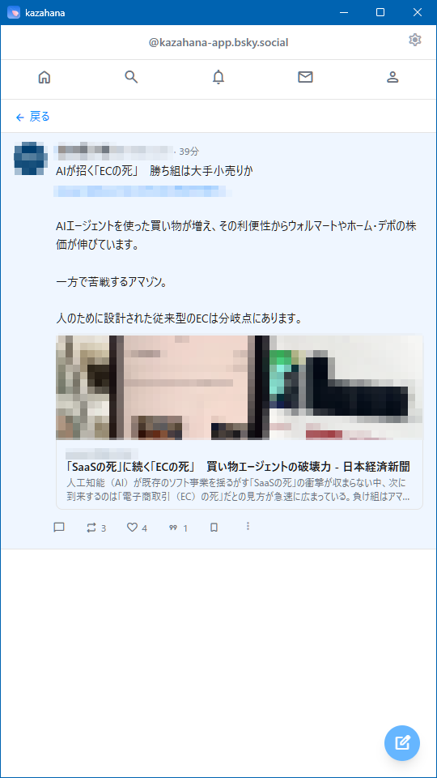

Click "← Back" to return. The full post body is displayed with expanded link cards and images. The action bar is fully functional.

### Thread View

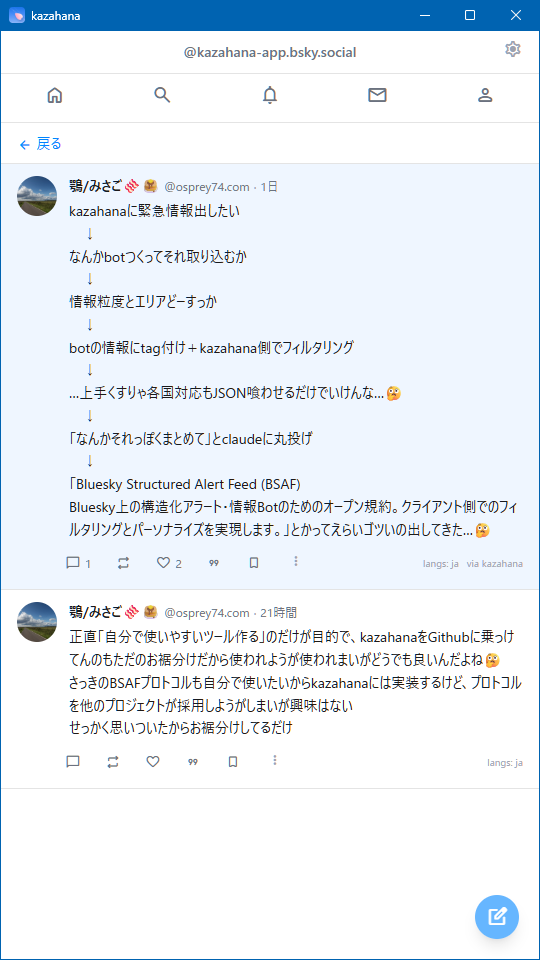

Replies are displayed in a thread format below the original post in chronological order.

---

## Settings

Click the ⚙ icon on the right side of the user bar to open settings.

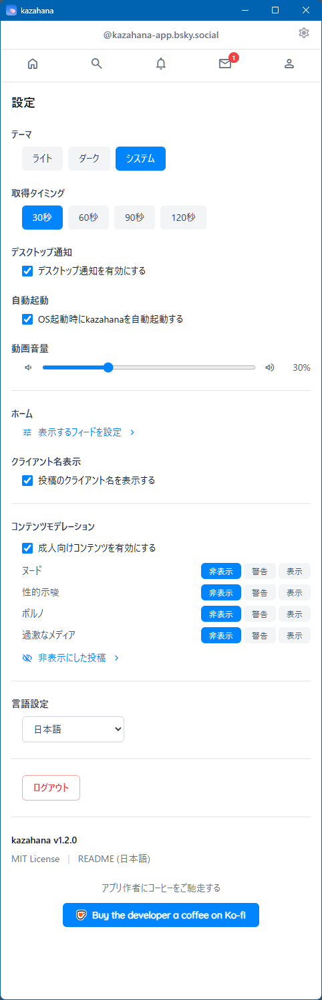

### Theme

| Option | Description |
|--------|-------------|
| **Light** | Light color scheme |
| **Dark** | Dark color scheme |
| **System** | Automatically switches based on OS settings |

### Fetch Interval

Sets the auto-refresh interval: "30s," "60s," "90s," or "120s."

### Desktop Notifications

Toggle OS desktop notifications for new activity.

### Auto Launch

Toggle auto-launch on OS startup.

### Close Button

Choose what happens when you click the close (✕) button: "Exit the application" (default) or minimize. The label adapts to the OS: on macOS it reads "Minimize to Dock," and on Windows/Linux it reads "Minimize to system tray." When minimized, right-click the tray icon (or Dock icon on macOS) and select "Exit" / "Quit" to quit the program.

### Video Volume

Adjust video playback volume (0–100%).

### Feed Display Settings

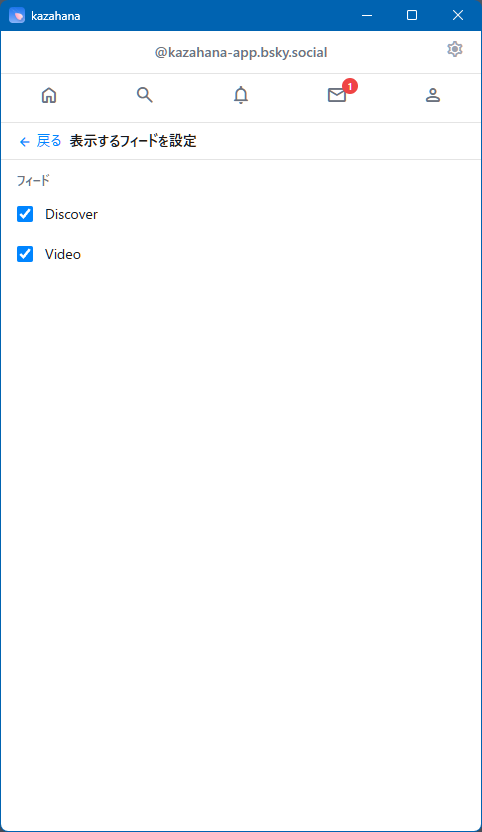

Click "Configure displayed feeds >" to open the feed management screen.

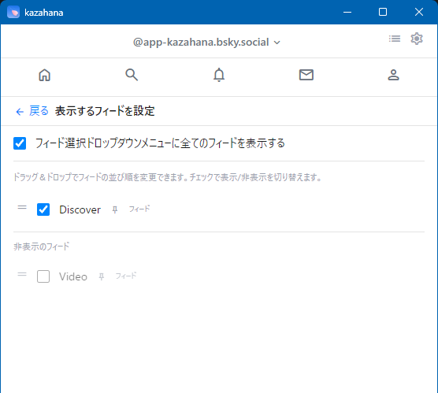

**Toggling visibility:** Each feed has a checkbox. Checked feeds appear as tabs on the home screen; unchecked feeds are hidden.

**Reordering feeds:** Drag the handle (≡) on the left side of each feed row to reorder. The order here determines the tab order on the home screen.

**Quick jump menu:** The "Show all feeds in quick jump menu" checkbox at the top controls whether hidden feeds also appear in the feed quick-jump menu in the header.

> **Note:** The "Home" tab is always displayed and is not included in this list.

### Client Name Display

Enable to show the posting client name (e.g., `via kazahana`) on each post.

### Content Moderation

| Item | Description |
|------|-------------|
| **Enable adult content** | Toggle on/off with the checkbox |
| **Per-category settings** | Set "Nudity," "Sexual Suggestiveness," "Pornography," and "Graphic Media" to "Hide," "Warn," or "Show" |

Click "Hidden posts >" to view posts hidden by moderation.

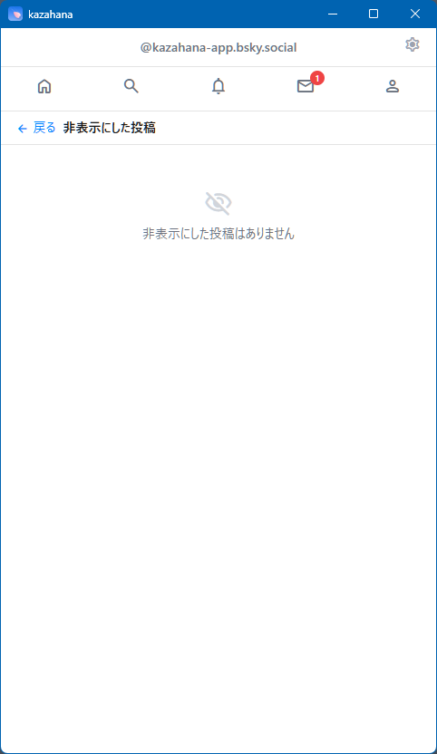

### Language Setting

Switch the app's UI language using the dropdown.

### Claude API Key

Register a Claude API key to enable [AI Alt Text generation](#ai-alt-text-generation) for images. Enter your API key in the input field and click "Register." The key can be shown/hidden with the visibility toggle.

### Watermark Settings

Configure automatic watermarks on images you post.


1. **Enable watermarks** — Check to enable the feature. All options below appear when enabled.
2. **Preset** — Choose from: Copyright, AI (JP), AI (EN), AI (Both), Photo, or Custom.
3. **Custom text** — If "Custom" is selected, enter your watermark text (max 50 characters).
4. **Position** — Choose from 6 fixed positions (top-left, top-center, top-right, bottom-left, bottom-center, bottom-right), Random, or Tile.
5. **Opacity** — Adjust from 20% to 100%.
6. **Font size** — Adjust from 8px to 20px.
7. **Text color** — Pick from 16 preset colors or enter a hex code manually.
8. **Confirm before posting** — When checked, a preview dialog appears before posting, letting you choose to post with or without the watermark.

   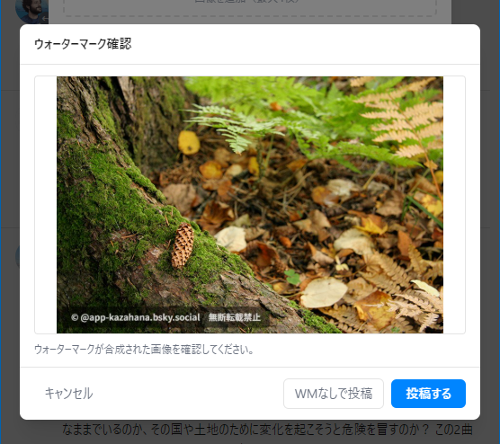
9. **Skip video** — When checked, watermarks are applied to images only, not videos.

A live preview updates in real-time as you adjust settings.

### Log Out

Click "Log out" to return to the login screen.

### App Information

| Item | Description |
|------|-------------|
| **Version** | Current app version (e.g., `kazahana v1.4.0`) |
| **MIT License** | Link to the license |
| **README** | Link to the app's README |
| **Buy the developer a coffee on Ko-fi** | Support the developer |

---

## Multi-Account

kazahana supports multiple Bluesky accounts. All account management is done from the **Settings** screen.


### Adding an Account

1. Open **Settings** and scroll to the Accounts section.
2. Click **Add Account**.
3. Enter the handle and app password for the new account and log in.

### Switching Accounts

In **Settings**, click the account you want to switch to. The active account is marked with a checkmark and "(active account)" label.

### Removing an Account

Click the ✕ icon next to an account in Settings. A confirmation dialog appears — click "Remove Account" to confirm. This removes the saved credentials from kazahana; it does not delete the Bluesky account itself.

---

## Keyboard Shortcuts

| Key | Action | Where |
|-----|--------|-------|
| **F5** | Refresh the current feed | Home, Notifications, Messages, Profile |
| **n** | Open new post composer | Anywhere except Settings or text inputs. On a profile page, auto-inserts @mention |
| **Alt+Enter** (Win/Linux) / **Option+Enter** (macOS) | Submit post or message | Compose modal, DM input |
| **Escape** | Close modal / dialog | Any open modal |
| **←** / **→** | Previous / next image | Image lightbox |
| **Enter** | Send message | DM thread input (Shift+Enter for new line) |

---

## BSAF (Structured Alert Feed)

kazahana supports the [BSAF protocol](https://github.com/osprey74/bsaf-protocol) (Bluesky Structured Alert Feed), enabling structured filtering of alert bot posts such as earthquake and tsunami warnings.

### Enabling BSAF

In Settings, check "Enable kazahana as a BSAF-compatible client." When enabled, a link to "Manage BSAF Bots >" appears below the checkbox.

### Registering a Bot

> **Guide:** For a detailed walkthrough from registration to filter setup, see "[How to Register a BSAF Bot](./bsaf-bot-registration.md)."

On the BSAF bot management screen, you can register BSAF-compatible bots using one of two methods:

| Method | Description |
|--------|-------------|
| **URL input** | Enter the URL of a Bot Definition JSON and click "Fetch." GitHub repository URLs are automatically converted to raw content URLs. |
| **Local file** | Click "or load from JSON file" to select a local `bot-definition.json` file. |

### Filter Settings

Click a registered bot's name to expand its filter settings. Each filter group (e.g., event type, severity, region) can be individually toggled. "Select all" and "Deselect all" buttons are available for each group.

> **Important: AND-based filtering** — All filter conditions must match for a post to appear. For example, if you set the event type to "earthquake" and the region to "Hokkaido," only earthquake posts targeting Hokkaido will be displayed. Posts about earthquakes in other regions will be filtered out.

### Where Filters Apply

BSAF filters are applied to the **Home Timeline** and **Custom Feeds** only. On a bot's **Profile page**, all posts are always displayed without filtering. This means you can visit a bot's profile at any time to review the complete history of alerts, including those outside your current filter settings.

### Duplicate Detection

When multiple BSAF bots report the same event (same type, value, time, and target), kazahana automatically collapses duplicates — only the first bot's post is shown, with a note indicating how many other bots reported the same event.

### Unregistering a Bot

Click "Unregister" on a bot's expanded panel. This removes the bot from kazahana and automatically unfollows the bot's account.

---

## Bookmarklet

You can use a bookmarklet to quickly share the page you are currently viewing in your browser to kazahana's compose screen. The page title and URL are automatically filled in, and a link card (OGP preview) is also generated.

### Bookmarklet Code

Copy the code below and paste it as the URL when creating a bookmark manually.

```
javascript:void(function(){var t=encodeURIComponent(document.title),u=encodeURIComponent(location.href);window.open('kazahana://compose?title='+t+'&url='+u,'_self')})()
```

### Setup by Browser

#### Google Chrome / Microsoft Edge / Brave

1. Make sure the bookmarks bar is visible (press `Ctrl+Shift+B` to toggle).
2. Right-click the bookmarks bar → "Add page..." → Enter `Share to kazahana` as the name, and paste the bookmarklet code above as the URL.

#### Mozilla Firefox

1. Make sure the bookmarks toolbar is visible (`Ctrl+Shift+B`, or View → Toolbars → Bookmarks Toolbar).
2. Right-click the bookmarks toolbar → "Add Bookmark..." → Enter `Share to kazahana` as the name, and paste the bookmarklet code as the Location (URL).

#### Safari (macOS)

1. Show the Favorites Bar (View → Show Favorites Bar, or `Cmd+Shift+B`).
2. First, bookmark any page (e.g., Bookmarks → Add Bookmark → save to Favorites Bar).
3. Right-click the newly created bookmark → "Edit Address..." → Replace the URL with the bookmarklet code above.
4. Rename the bookmark to `Share to kazahana`.

### How to Use

1. Open any web page in your browser.
2. Click the "Share to kazahana" bookmark on the bookmarks bar.
3. kazahana will open (or come to the foreground if already running) with the compose screen pre-filled with the page title and URL. A link card is also automatically generated.
4. Edit the text if needed, then click "Post."

> **Note:** kazahana must be installed on your computer for the bookmarklet to work. If kazahana is not installed, clicking the bookmarklet will have no effect.
