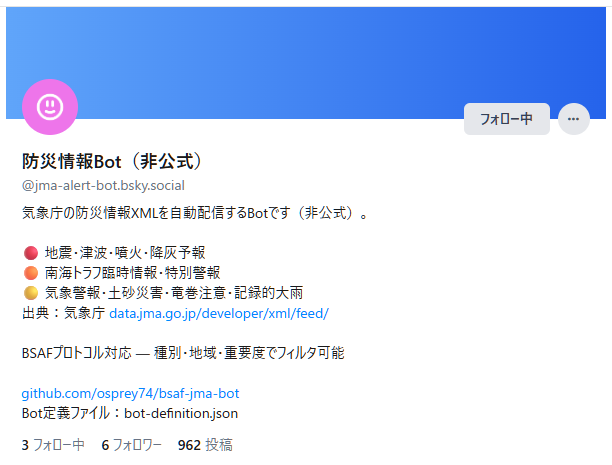
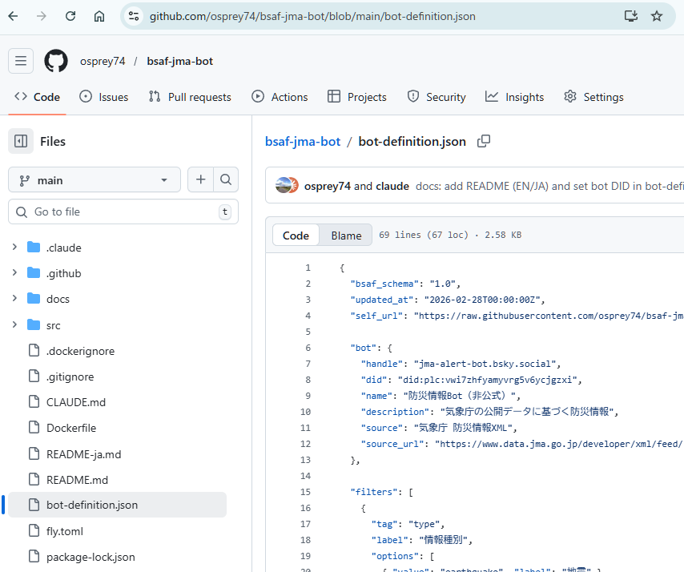
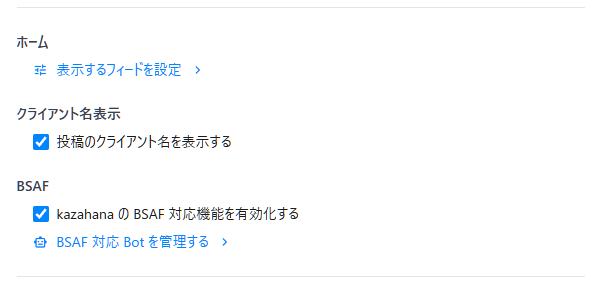
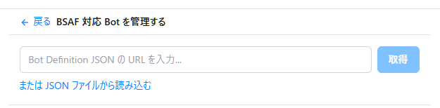
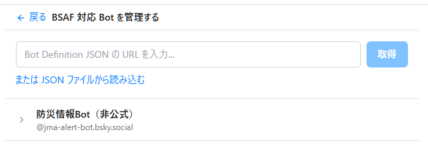
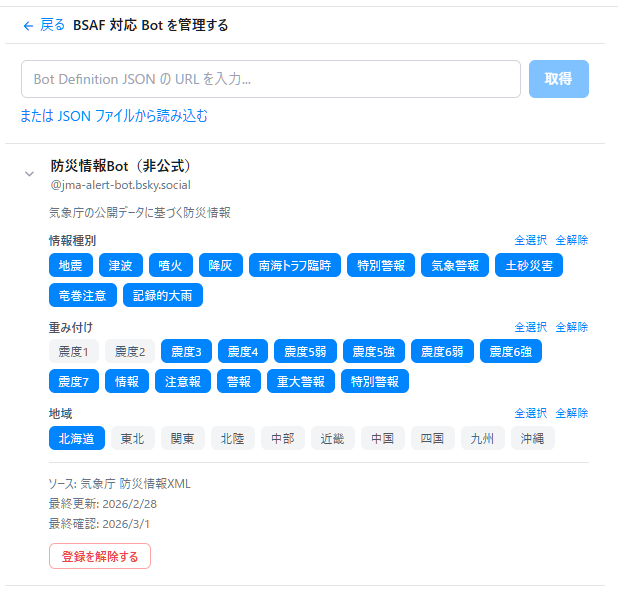
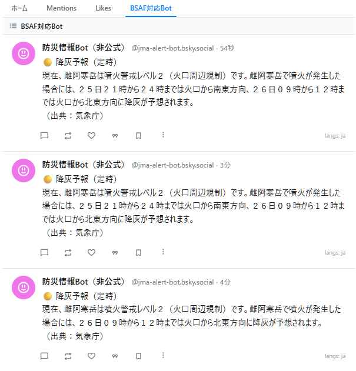

# BSAF 対応 Bot の登録手順

このガイドでは、BSAF（Bluesky Structured Alert Framework）対応 Bot を kazahana に登録し、必要な情報だけを受け取れるようにフィルタリングを設定する手順を説明します。

ここでは例として、気象庁の防災情報を配信する **bsaf-jma-bot**（[@jma-alert-bot.bsky.social](https://bsky.app/profile/jma-alert-bot.bsky.social)）を登録します。

## 目次

- [前提条件](#前提条件)
- [Step 1：Bot をフォローする](#step-1bot-をフォローする)
- [Step 2：Bot 定義 JSON を入手する](#step-2bot-定義-json-を入手する)
- [Step 3：BSAF 機能を有効化する](#step-3bsaf-機能を有効化する)
- [Step 4：Bot 定義 JSON を登録する](#step-4bot-定義-json-を登録する)
- [Step 5：フィルタリング設定画面を開く](#step-5フィルタリング設定画面を開く)
- [Step 6：受け取りたい情報を選択する](#step-6受け取りたい情報を選択する)
- [Step 7：タイムラインで確認する](#step-7タイムラインで確認する)
- [登録の流れ（まとめ）](#登録の流れまとめ)
- [関連リンク](#関連リンク)

---

## 前提条件

- kazahana がインストール済みであること
- Bluesky アカウントでログイン済みであること

---

## Step 1：BSAF 対応 Bot をフォローする

Bluesky 上で、登録したい BSAF 対応 Bot のアカウントをフォローします。

> **ヒント:** 専用のリストを作成し、BSAF 対応 Bot をまとめておくと管理しやすくなります。



---

## Step 2：Bot 定義 JSON を入手する

BSAF 対応 Bot は、フィルタリングに必要な情報をまとめた **Bot 定義 JSON** を公開しています。登録には、以下のいずれかが必要です。

| 方法 | 説明 |
|------|------|
| **配布 URL（推奨）** | Bot の README やプロフィールに記載されている JSON の URL |
| **JSON ファイル** | ダウンロード済みの JSON ファイル |

bsaf-jma-bot の場合、Bot 定義 JSON の URL は以下のとおりです。

```
https://raw.githubusercontent.com/osprey74/bsaf-jma-bot/main/bot-definition.json
```



---

## Step 3：BSAF 機能を有効化する

1. kazahana の **管理画面** を開きます。
2. 「**kazahana の BSAF 対応機能を有効化する**」のチェックボックスをオンにします。
3. チェックボックスの下に表示される「**BSAF 対応 Bot を管理する**」リンクをクリックします。



---

## Step 4：Bot 定義 JSON を登録する

「**BSAF 対応 Bot を管理する**」画面が開きます。以下のいずれかの方法で Bot 定義 JSON を読み込みます。

### URL から取得する場合（推奨）

1. 「**Bot Definition JSON の URL を入力**」欄に、Step 2 で入手した URL を貼り付けます。
2. 「**取得**」ボタンをクリックします。

### ファイルから読み込む場合

1. 「**または JSON ファイルから読み込む**」をクリックします。
2. ファイル選択ダイアログが表示されるので、ダウンロード済みの JSON ファイルを選択します。



---

## Step 5：フィルタリング設定画面を開く

登録が完了すると、BSAF 対応 Bot の **名前** と **ハンドル名** が一覧に表示されます。

表示された Bot 名をクリックして、フィルタリング設定画面を開きます。



---

## Step 6：受け取りたい情報を選択する

BSAF 対応 Bot に関連付けられたタグ（情報の種類・地域など）が一覧表示されます。

**受け取りたい情報のタグを選択して青色にします。** 青色になったタグに該当する情報のみが、タイムラインに表示されるようになります。

bsaf-jma-bot の場合、以下のようなタグを設定できます。

| 設定項目 | 内容 | 例 |
|----------|------|-----|
| **type（情報の種類）** | 受け取りたい災害種別 | earthquake（地震）、tsunami（津波）、eruption（噴火）など |
| **value（情報の規模）** | 受け取りたい規模の下限 | 震度3以上、震度5弱以上 など |
| **target（対象地域）** | 受け取りたい地域 | jp-hokkaido（北海道）、jp-kanto（関東）など |

> **ヒント:** 自分の居住地域と、関心のある災害種別だけを選択しておくと、本当に必要な情報だけを受け取れます。



---

## Step 7：タイムラインで確認する

設定完了後、kazahana の **タイムライン** または **リスト画面** を確認します。

BSAF 対応 Bot の投稿のうち、Step 6 で選択したフィルタ条件に合致する情報のみが表示されます。条件に合致しない投稿は自動的にフィルタリングされ、表示されません。



---

## 登録の流れ（まとめ）

```
Bot をフォロー → Bot 定義 JSON を入手 → BSAF 機能を有効化
→ JSON を登録 → フィルタリング設定 → タイムラインで確認
```

---

## 関連リンク

- [BSAF プロトコル仕様](https://github.com/osprey74/bsaf-protocol)
- [bsaf-jma-bot リポジトリ](https://github.com/osprey74/bsaf-jma-bot)
- [kazahana 公式サイト](../)
- [kazahana リポジトリ](https://github.com/osprey74/kazahana)
