# 操作マニュアル

kazahana は、Bluesky の軽量デスクトップクライアントアプリです。このマニュアルでは、各画面の名称と機能について解説します。

**対応バージョン: kazahana v2.5.1**

## 目次

- [ログイン](#ログイン)
- [画面の基本構成](#画面の基本構成)
- [ホーム（タイムライン）](#ホームタイムライン)
- [検索](#検索)
- [通知](#通知)
- [ダイレクトメッセージ](#ダイレクトメッセージ)
- [プロフィール](#プロフィール)
- [新規投稿](#新規投稿)
- [投稿詳細・スレッド](#投稿詳細スレッド)
- [設定](#設定)
- [マルチアカウント](#マルチアカウント)
- [キーボードショートカット](#キーボードショートカット)
- [BSAF（構造化アラートフィード）](#bsaf構造化アラートフィード)
- [ブックマークレット](#ブックマークレット)

---

## ログイン

アプリを起動すると、ログイン画面が表示されます。

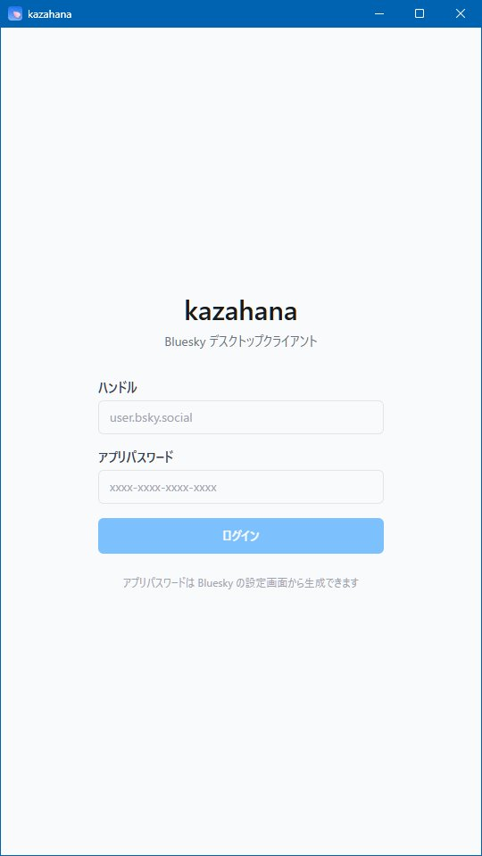

| 項目 | 説明 |
|------|------|
| **ハンドル** | Bluesky のハンドルを入力します（例: `user.bsky.social`） |
| **アプリパスワード** | Bluesky で生成したアプリパスワードを入力します（形式: `xxxx-xxxx-xxxx-xxxx`） |
| **ログインボタン** | 入力した情報でログインを実行します |

画面下部の「アプリパスワードは Bluesky の設定画面から生成できます」のリンクから、Bluesky のアプリパスワード設定ページにアクセスできます。

> **ヒント:** kazahana ではアカウントの通常パスワードではなく、Bluesky の設定画面で発行する「アプリパスワード」を使用します。

---

## 画面の基本構成

ログイン後の各画面は、共通のレイアウトで構成されています。

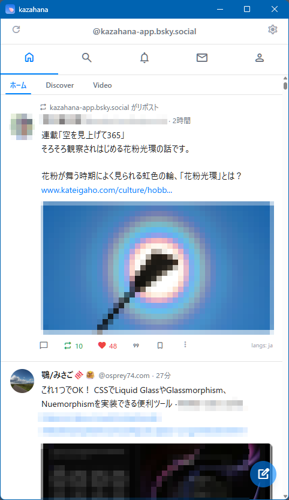

### タイトルバー

画面最上部に表示されます。アプリ名「kazahana」と、ウィンドウ操作ボタン（最小化・最大化・閉じる）が配置されています。

### ユーザーバー

| 位置 | 要素 | 説明 |
|------|------|------|
| 左 | リロードボタン | タイムラインを手動で更新します |
| 中央 | ハンドル表示 | ログイン中のアカウントのハンドルが表示されます |
| 右 | 設定アイコン（⚙） | [設定画面](#設定)を開きます |

### ナビゲーションバー

ユーザーバーの下に、5つのアイコンが横並びで表示されます。各アイコンをクリックすると対応する画面に切り替わります。

| アイコン | 画面 | 説明 |
|----------|------|------|
| 🏠 | [ホーム](#ホームタイムライン) | タイムラインを表示します |
| 🔍 | [検索](#検索) | ユーザーや投稿を検索します |
| 🔔 | [通知](#通知) | いいね・リポスト等の通知を表示します |
| ✉️ | [ダイレクトメッセージ](#ダイレクトメッセージ) | DM の会話一覧を表示します |
| 👤 | [プロフィール](#プロフィール) | 自分のプロフィールを表示します |

未読のダイレクトメッセージがある場合、✉️ アイコンに赤い数字のバッジが表示されます。

### 新規投稿ボタン（FAB）

画面右下に常時表示される青い丸ボタンです。クリックすると[新規投稿画面](#新規投稿)が開きます。また、タイムライン表示中に「n」キーを押下することでも新規投稿画面が開きます。

---

## ホーム（タイムライン）

ナビゲーションバーの 🏠 アイコンで表示される画面です。フォロー中のユーザーの投稿が時系列で表示されます。

### フィードタブ

| タブ | 説明 |
|------|------|
| **ホーム** | フォロー中のユーザーの投稿を表示します（常時表示） |
| **Discover** | おすすめの投稿を表示します（表示/非表示を設定可能） |
| **Video** | 動画投稿を表示します（表示/非表示を設定可能） |

表示するフィードタブは、[設定画面](#表示するフィードを設定)からカスタマイズできます。

### 投稿カード

| 要素 | 説明 |
|------|------|
| **リポストラベル** | リポストされた投稿の場合、上部に「○○ がリポスト」と表示されます |
| **アバター** | 投稿者のプロフィール画像です。クリックで投稿者のプロフィール画面を開きます |
| **表示名・ハンドル** | 投稿者の表示名とハンドル（`@xxx`）が表示されます |
| **経過時間** | 投稿からの経過時間（「27分」「2時間」「2日」など）が表示されます |
| **投稿本文** | テキスト、リンク、ハッシュタグなどが表示されます |
| **画像サムネイル** | 投稿に画像が含まれる場合、サムネイルが表示されます |
| **リンクカード** | 投稿に URL が含まれる場合、OGP 情報（サムネイル・タイトル・説明文）がカード形式で表示されます |
| **言語ラベル** | 投稿の言語が右下に表示されます（例: `langs: ja`） |
| **クライアント名** | 設定で有効にしている場合、投稿元のクライアント名（例: `via kazahana`）が表示されます |

### アクションバー

各投稿カードの下部に、操作アイコンが横並びで表示されます。

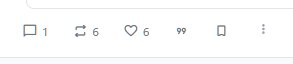

| アイコン | クリック時の動作 | 数字の表示 | 数字クリック時の動作 |
|----------|------------------|------------|----------------------|
| 💬 返信 | 返信の作成画面を開く | あり | ―（一覧表示なし） |
| 🔁 リポスト | 即座にリポストを実行 | あり | リポストした人の一覧を表示 |
| ♡ いいね | いいねを付ける／取り消す | あり | いいねした人の一覧を表示 |
| 「99」引用 | ポップアップメニューを表示 | ― | ― |
| 🔖 ブックマーク | 投稿をブックマークに保存／解除 | ― | ― |
| ⋮ メニュー | その他の操作メニューを開く | ― | ― |

#### 引用ポップアップメニュー

「99」引用アイコンをクリックすると、以下のメニューが表示されます。

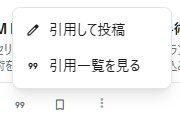

| 項目 | 説明 |
|------|------|
| **引用して投稿** | 引用リポストの作成画面を開きます |
| **引用一覧を見る** | この投稿を引用した投稿の一覧を表示します |

### 既読位置マーカー

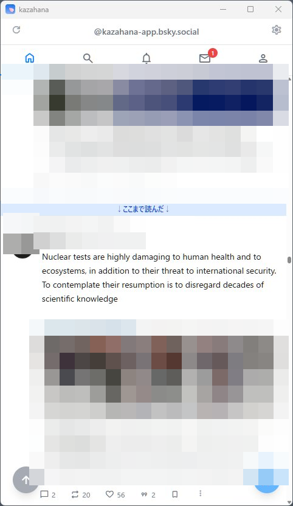

タイムライン上に「↓ここまで読んだ↓」と書かれた青い横バーが表示されます。前回閲覧した位置を示しており、どこまで読んだかが一目でわかります。

### トップへ戻るボタン

タイムラインを下にスクロールすると、画面左下に青い丸ボタン（↑矢印アイコン）が表示されます。クリックするとフィードの先頭に戻ります。

---

## 検索

ナビゲーションバーの 🔍 アイコンで表示される画面です。

### 検索の初期画面


| 要素 | 説明 |
|------|------|
| **検索入力フィールド** | 「ユーザーや投稿を検索...」と表示されます。テキストを入力して Enter で検索を実行します |
| **検索履歴** | 過去の検索キーワードが一覧表示されます |
| **個別削除（×）** | 各履歴の右側の × ボタンで個別に削除できます |
| **すべて削除** | 右上のリンクで検索履歴を一括削除できます |

### 検索結果

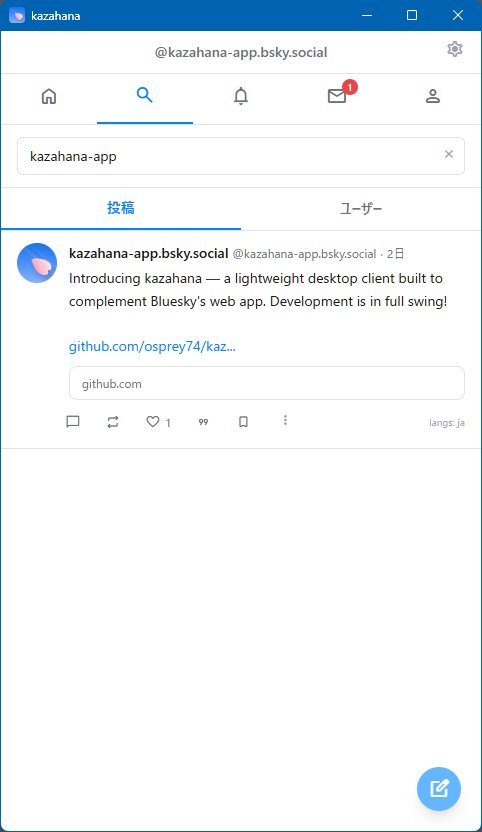

検索を実行すると、結果が「投稿」「ユーザー」の2つのタブで表示されます。

| タブ | 説明 |
|------|------|
| **投稿** | 検索キーワードに一致する投稿がカード形式で表示されます（デフォルト） |
| **ユーザー** | 検索キーワードに一致するユーザーが一覧表示されます |

検索入力フィールドの右側にある × ボタンで、入力をクリアして初期画面に戻れます。

---

## 通知

ナビゲーションバーの 🔔 アイコンで表示される画面です。


新しい通知が時系列で上から一覧表示されます。各通知には、アクションの種類・実行したユーザーの情報・対象の投稿プレビュー・経過時間が含まれます。

### 通知の種類

| アイコン | 種類 | 内容 |
|----------|------|------|
| ❤️ | いいね | 自分の投稿がいいねされた |
| 💬 | 返信 | 自分の投稿に返信があった |
| 👤 | フォロー | 自分のアカウントがフォローされた |
| 🔁 | リポスト | 自分の投稿がリポストされた |
| 「99」 | 引用 | 自分の投稿が引用リポストされた |
| @ | メンション | 他のユーザーの投稿で自分が言及された |
| ❤️ | リポストへのいいね | 自分のリポストがいいねされた |
| 🔁 | リポストのリポスト | 自分のリポストがリポストされた |

---

## ダイレクトメッセージ

ナビゲーションバーの ✉️ アイコンで表示される画面です。

### 会話一覧

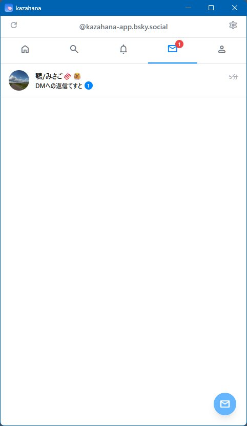

| 要素 | 説明 |
|------|------|
| **アバター・表示名** | 会話相手のプロフィール情報です |
| **最新メッセージプレビュー** | 最新のメッセージの冒頭が表示されます |
| **経過時間** | 最新メッセージの経過時間です |
| **未読バッジ** | 未読メッセージがある場合、緑色の丸に件数が表示されます |

会話をクリックするとスレッド（個別のやり取り画面）が開きます。

画面右下の青い丸ボタン（✉ アイコン）をクリックすると、新しい DM の会話を開始できます。

### スレッド表示

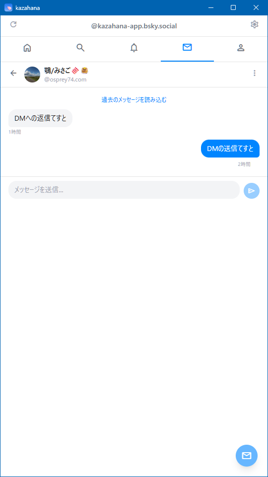

| 要素 | 説明 |
|------|------|
| **← 戻るボタン** | 会話一覧に戻ります |
| **相手の情報** | アバター・表示名・ハンドルが表示されます |
| **⋮ メニュー** | その他の操作メニューを開きます |
| **過去のメッセージを読み込む** | クリックすると、さらに古いメッセージを取得します |
| **メッセージ表示エリア** | 相手のメッセージは左寄せ・グレー背景、自分のメッセージは右寄せ・青背景の吹き出しで表示されます。各メッセージの下に経過時間が表示されます |
| **メッセージ入力エリア** | テキストを入力し、右側の送信ボタン（▶）でメッセージを送信します |

---

## プロフィール

ナビゲーションバーの 👤 アイコンで自分のプロフィールが表示されます。他ユーザーのアバターや表示名をクリックした場合は、そのユーザーのプロフィールが表示されます。

### 自分のプロフィール

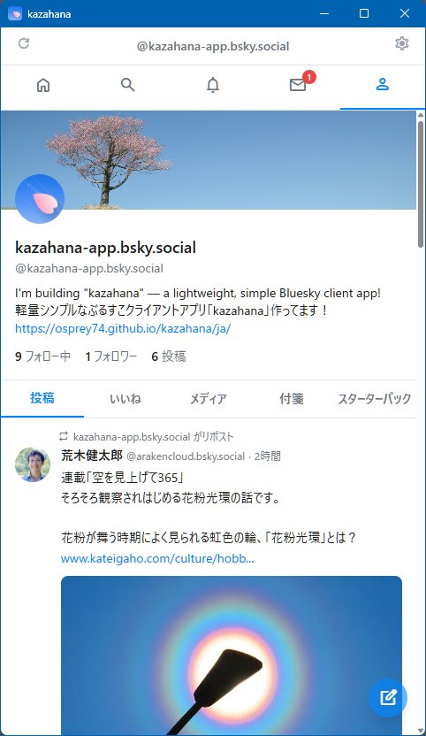

| 要素 | 説明 |
|------|------|
| **バナー画像** | 画面上部の背景画像です |
| **アバター** | 丸型のプロフィール画像です |
| **表示名・ハンドル** | アカウントの表示名とハンドルです |
| **自己紹介（Bio）** | プロフィールの自己紹介文とリンクです |
| **フォロー中** | クリックでフォロー中ユーザーの一覧を表示します |
| **フォロワー** | クリックでフォロワーの一覧を表示します |
| **投稿数** | 投稿の総数です（クリック非対応） |

#### コンテンツタブ

| タブ | 説明 |
|------|------|
| **投稿** | 自分の投稿・リポストの一覧です |
| **返信** | 自分の返信の一覧です |
| **メディア** | 画像・動画を含む投稿のみ表示します |
| **いいね** | 自分がいいねした投稿の一覧です |
| **ブックマーク** | ブックマークした投稿の一覧です |
| **スターターパック** | 自分が作成したスターターパックの一覧です |

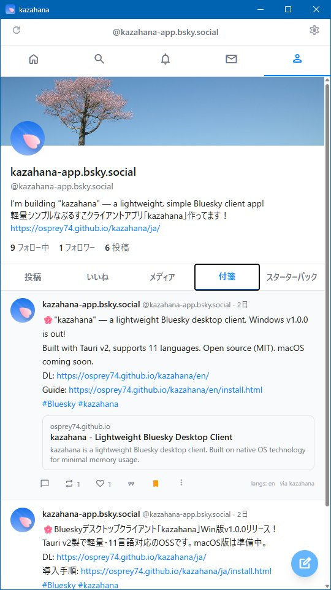

### 他ユーザーのプロフィール

他ユーザーのプロフィールでは、バナー画像の右下にフォロー操作ボタンが表示されます。

**未フォロー時:**

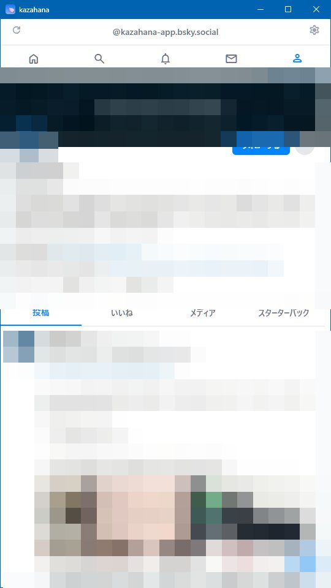

「フォローする」ボタン（青背景）が表示されます。クリックでフォローします。

**フォロー中:**

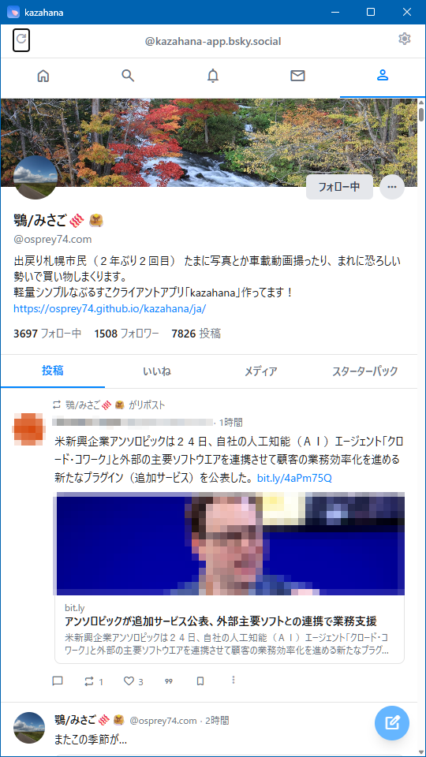

「フォロー中」ボタン（白背景）が表示されます。クリックでフォローを解除します。

#### 「...」メニュー

| 項目 | 説明 |
|------|------|
| **リストに追加／削除** | ユーザーをリストに追加または削除します |
| **ミュートする** | ユーザーをミュートします |
| **ブロックする** | ユーザーをブロックします |
| **このユーザーを通報** | ユーザーを通報します |

> **補足:** 他ユーザーのプロフィールでは、コンテンツタブに「ブックマーク」タブは表示されません。

### フォロー中・フォロワー一覧

プロフィール画面の「フォロー中」「フォロワー」をクリックすると、それぞれの一覧画面が表示されます。


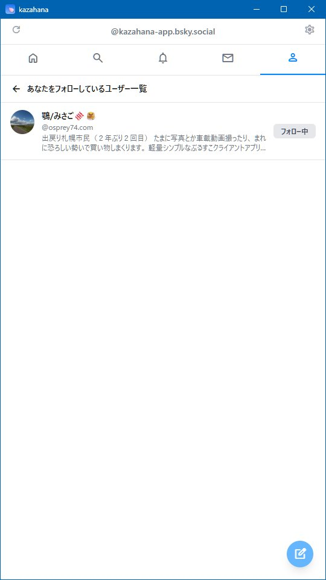

各ユーザーの情報として、アバター・表示名・ハンドル・Bio の冒頭が表示されます。

| 画面 | 右側の表示 |
|------|------------|
| **フォロー中一覧** | 相手が自分をフォローしているかどうかの状態ラベル |
| **フォロワー一覧** | 「フォロー中」ボタン（フォロー済みの場合） |

---

## 新規投稿

画面右下の新規投稿ボタン（FAB）をクリックすると、投稿作成画面がモーダルで表示されます。

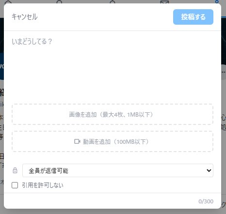

| 要素 | 説明 |
|------|------|
| **キャンセル** | 投稿を中止してモーダルを閉じます |
| **投稿するボタン** | 投稿を実行します。また、Alt+エンターキー（Windows版）／Option+エンターキー（macOS版）の押下でも投稿を実行できます |
| **テキスト入力エリア** | 投稿本文を入力します。プレースホルダーは「いまどうしてる？」です |
| **文字数カウンター** | 右下に現在の文字数と上限が表示されます（0/300） |
| **画像を追加** | 画像ファイルを選択して添付します（最大4枚、1MB以下） |
| **動画を追加** | 動画ファイルを選択して添付します（100MB以下） |
| **返信範囲の設定** | 「全員が返信可能」のドロップダウンで、返信できるユーザーの範囲を設定します |
| **引用を許可しない** | チェックを入れると、この投稿の引用リポストを禁止します |

### 下書き

作成途中の投稿を下書きとして保存し、あとから編集を再開できます。

**下書きの保存:** 投稿作成モーダルのヘッダーにある下書きアイコン（📝）をクリックすると、現在の投稿内容が下書きとして保存されます。最大 **20件** まで保存可能です。

**下書きの読み込み:** 下書きアイコンをクリックして下書き一覧を開き、読み込みたい下書きをクリックします。読み込まれた下書きは一覧から削除されます。


**下書きの削除:** 各下書きの右側にあるゴミ箱アイコンをクリックすると個別に削除できます。すべての下書きを削除するには、一覧上部の「すべて削除」をクリックし、確認ダイアログで承認してください。

> **補足:** 画像付きの下書きを保存する際、設定によっては画質に関する警告が表示されることがあります。

### 画像編集

画像付きの投稿を作成する際、投稿前に各画像を編集できます。

投稿作成モーダルの画像サムネイルにある編集アイコンをクリックすると、画像エディタが開きます。

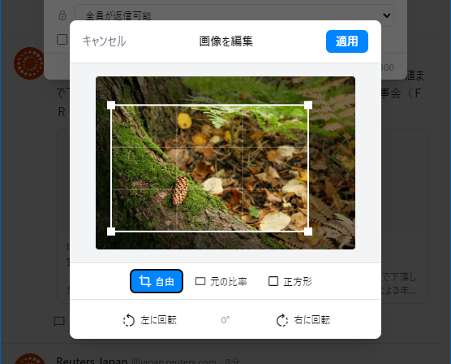

**クロップモード:**

| モード | 説明 |
|--------|------|
| **フリー** | 縦横比の制約なく自由にクロップ |
| **オリジナル** | 元画像のアスペクト比を維持してクロップ |
| **正方形** | 1:1 の正方形にクロップ |

クロップ範囲の角や辺をドラッグしてサイズを変更できます。範囲内をドラッグして位置を移動できます。構図の参考として三分割グリッドが表示されます。

**回転:**

| ボタン | 操作 |
|--------|------|
| **左回転** | 反時計回りに90°回転 |
| **右回転** | 時計回りに90°回転 |

ボタンの間に現在の回転角度が表示されます。

**適用** をクリックして編集を保存、**キャンセル** で破棄します。

### AI Alt Text 自動生成

Claude API を使用して、画像の代替テキスト（Alt Text）を自動生成できます。


**事前設定:** 設定画面で Claude API キーを登録しておく必要があります（設定の [Claude API キー](#claude-api-キー) を参照）。

**Alt Text の生成手順:**

1. 投稿に画像を追加します。
2. 画像の編集画面を開きます。
3. 「Alt を編集」をクリックして Alt Text ダイアログを開きます。
4. 紫色の **生成** ボタンをクリックします。
5. AI が生成した説明文がテキスト欄に表示されます。
6. 必要に応じて内容を編集し、**OK** をクリックして保存します。

> **補足:** Claude API キーが未登録の場合、生成ボタンは無効（グレー）になります。Alt Text は現在の UI 言語で生成されます。

---

## 投稿詳細・スレッド

タイムラインや検索結果で投稿カードをクリックすると、投稿の詳細画面が表示されます。

### 投稿詳細

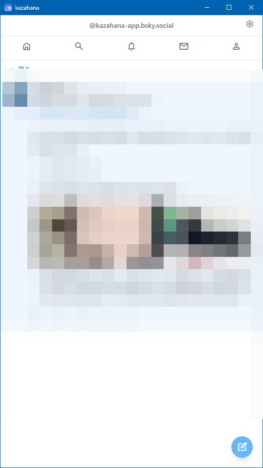

「← 戻る」ボタンで前の画面に戻ります。タイムライン上では省略されていた投稿本文が全文表示され、リンクカードや画像も展開されます。アクションバーも同様に操作可能です。

### スレッド表示

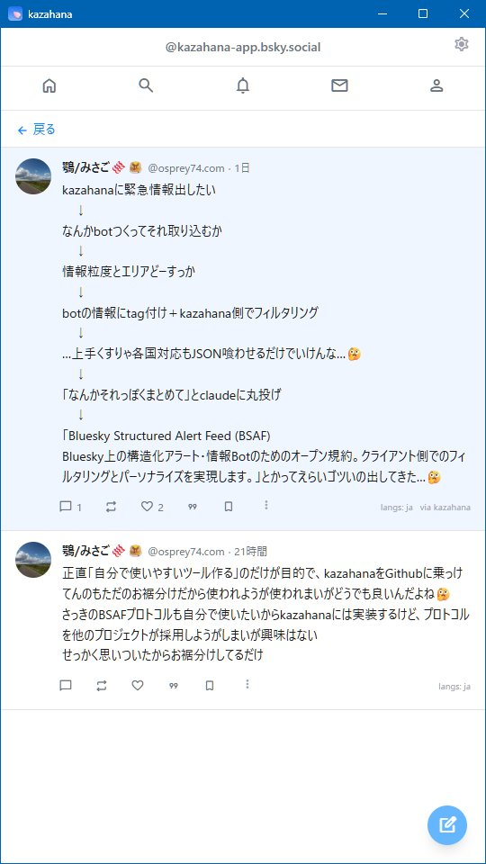

返信がある投稿では、元の投稿の下にスレッド形式で返信が時系列に表示されます。各返信も通常の投稿カードと同じレイアウトで表示されます。

---

## 設定

ユーザーバー右端の ⚙ アイコンをクリックすると、設定画面が表示されます。

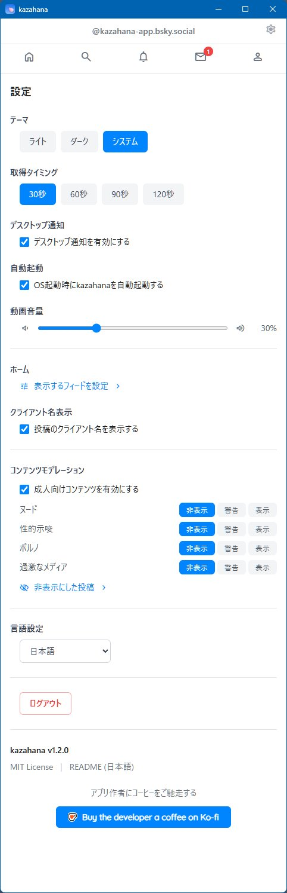

### テーマ

| 選択肢 | 説明 |
|--------|------|
| **ライト** | 明るい配色で表示します |
| **ダーク** | 暗い配色で表示します |
| **システム** | OS の設定に連動して自動で切り替えます |

### 取得タイミング

タイムラインの自動更新間隔を設定します。「30秒」「60秒」「90秒」「120秒」から選択できます。

### デスクトップ通知

「デスクトップ通知を有効にする」のチェックボックスで、OS のデスクトップ通知による新着通知の受け取りを切り替えます。

### 自動起動

「OS 起動時に kazahana を自動起動する」のチェックボックスで、パソコン起動時の自動起動を切り替えます。

### 閉じるボタンの動作

閉じる（✕）ボタンをクリックした際の動作を選択します。「アプリを終了する」（デフォルト）または最小化を選べます。表示はOSに応じて切り替わり、macOSでは「Dockに格納する」、Windows/Linuxでは「タスクトレイに最小化する」と表示されます。最小化した場合、プログラムを終了するにはトレイアイコン（macOSではDockアイコン）を右クリックし「Exit」/「終了」を選択してください。

### 動画音量

スライダーで動画再生時の音量を調整します（0〜100%）。

### 表示するフィードを設定

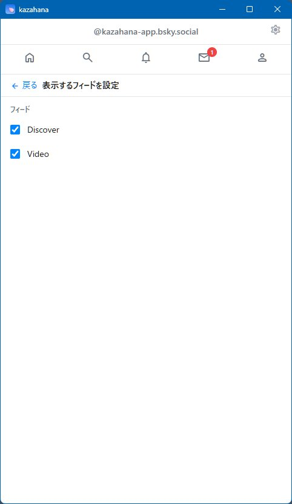

「表示するフィードを設定 >」をクリックすると、フィード管理画面が開きます。


**表示/非表示の切り替え:** 各フィードにはチェックボックスがあります。チェックを入れたフィードはホーム画面のタブに表示され、外したフィードは非表示になります。

**並び替え:** 各フィードの左端にあるドラッグハンドル（≡）をドラッグして順序を変更できます。ここでの順序がホーム画面のタブの並び順に反映されます。

**クイックジャンプメニュー:** 画面上部の「すべてのフィードをクイックジャンプメニューに表示する」チェックボックスで、非表示にしたフィードもヘッダーのクイックジャンプメニューに含めるかどうかを設定できます。

> **補足:** 「ホーム」タブは常時表示されるため、この一覧には含まれません。

### クライアント名表示

「投稿のクライアント名を表示する」のチェックボックスを有効にすると、各投稿の右下に投稿元のクライアント名（例: `via kazahana`）が表示されます。

### コンテンツモデレーション

| 項目 | 説明 |
|------|------|
| **成人向けコンテンツを有効にする** | チェックボックスで有効/無効を切り替えます |
| **カテゴリごとの設定** | 「ヌード」「性的示唆」「ポルノ」「過激なメディア」の各カテゴリについて、「非表示」「警告」「表示」の3段階で表示レベルを設定できます |

「非表示にした投稿 >」をクリックすると、モデレーションにより非表示となった投稿の一覧を確認できます。

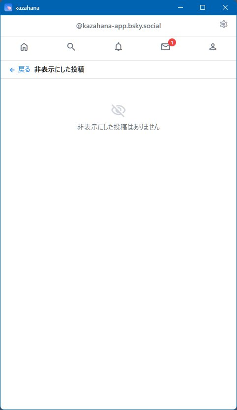

### 言語設定

ドロップダウンでアプリの UI 言語を切り替えます。

### Claude API キー

Claude API キーを登録すると、画像の [AI Alt Text 自動生成](#ai-alt-text-自動生成)が利用できるようになります。入力欄にAPIキーを入力し、「登録」をクリックします。表示/非表示の切り替えボタンでキーの確認ができます。

### ウォーターマーク設定

投稿する画像に自動でウォーターマーク（透かし文字）を追加できます。

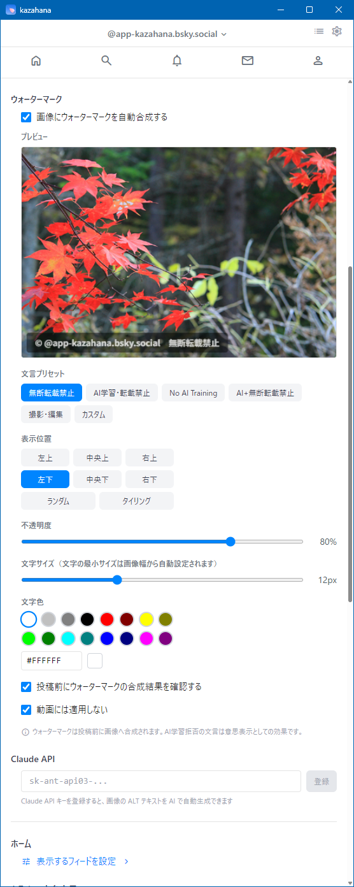

1. **ウォーターマークを有効にする** — チェックを入れると機能が有効になり、以下の設定項目が表示されます。
2. **プリセット** — Copyright、AI（日本語）、AI（英語）、AI（両方）、Photo、カスタム から選択します。
3. **カスタムテキスト** — 「カスタム」選択時にウォーターマークの文字列を入力します（最大50文字）。
4. **位置** — 6つの固定位置（左上・中央上・右上・左下・中央下・右下）、ランダム、タイル から選択します。
5. **不透明度** — 20%〜100% の範囲で調整します。
6. **フォントサイズ** — 8px〜20px の範囲で調整します。
7. **文字色** — 16色のプリセットカラーから選択するか、16進数カラーコードを直接入力します。
8. **投稿前に確認する** — チェックを入れると、投稿前にウォーターマークのプレビューダイアログが表示され、ウォーターマーク付き/なしを選択できます。

   
9. **動画にはウォーターマークを付けない** — チェックを入れると、画像のみにウォーターマークが適用されます。

設定変更はリアルタイムでプレビューに反映されます。

### ログアウト

「ログアウト」ボタンをクリックすると、現在のアカウントからログアウトし、ログイン画面に戻ります。

### アプリ情報

| 項目 | 説明 |
|------|------|
| **バージョン** | 現在のアプリバージョン（例: `kazahana v1.4.0`） |
| **MIT License** | ライセンス情報へのリンクです |
| **README** | アプリの README ページへのリンクです |
| **Buy the developer a coffee on Ko-fi** | 開発者への支援（寄付）リンクです |

---

## マルチアカウント

kazahana は複数の Bluesky アカウントに対応しています。アカウントの管理はすべて **設定** 画面から行います。

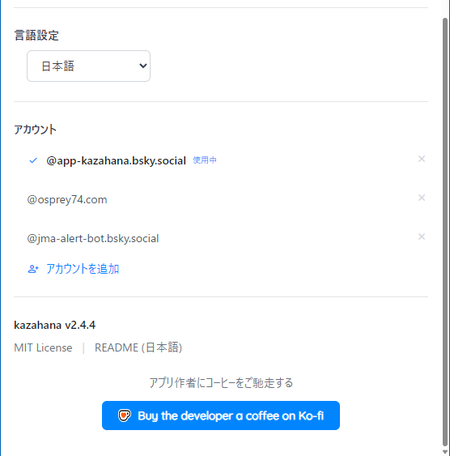

### アカウントの追加

1. **設定** 画面を開き、アカウントセクションまでスクロールします。
2. **アカウントを追加** をクリックします。
3. 新しいアカウントのハンドルとアプリパスワードを入力してログインします。

### アカウントの切り替え

**設定** 画面で切り替えたいアカウントをクリックします。現在のアカウントにはチェックマークと「(アクティブアカウント)」が表示されます。

### アカウントの削除

設定画面でアカウントの横にある ✕ アイコンをクリックします。確認ダイアログが表示されるので、「アカウントを削除」をクリックして確定します。これは kazahana から保存された認証情報を削除するもので、Bluesky アカウント自体は削除されません。

---

## キーボードショートカット

| キー | 操作 | 使用可能な場所 |
|------|------|----------------|
| **F5** | 現在のフィードを更新 | ホーム、通知、メッセージ、プロフィール |
| **n** | 新規投稿モーダルを開く | 設定画面・テキスト入力中以外。プロフィール画面では @メンションを自動挿入 |
| **Alt+Enter**（Win/Linux）/ **Option+Enter**（macOS） | 投稿またはメッセージを送信 | 投稿作成モーダル、DM 入力 |
| **Escape** | モーダル / ダイアログを閉じる | 各モーダル |
| **←** / **→** | 前の画像 / 次の画像 | 画像ライトボックス |
| **Enter** | メッセージを送信 | DM スレッド入力（Shift+Enter で改行） |

---

## BSAF（構造化アラートフィード）

kazahana は [BSAF プロトコル](https://github.com/osprey74/bsaf-protocol)（Bluesky Structured Alert Feed）に対応しており、地震・津波警報Botなどの構造化アラート投稿をフィルタリングできます。

### BSAF を有効にする

設定画面で「kazahana の BSAF 対応機能を有効化する」にチェックを入れます。有効にすると、チェックボックスの下に「BSAF 対応 Bot を管理する >」のリンクが表示されます。

### Bot の登録

> **ガイド:** Bot の登録からフィルタリング設定までの詳しい手順は「[BSAF 対応 Bot の登録手順](./bsaf-bot-registration.md)」をご覧ください。

> **デモで試す:** [BSAF デモページ](https://osprey74.github.io/kazahana/ja/demo/)で、クライアント側の BSAF パース・フィルタリング機能を実際に体験できます。

BSAF Bot 管理画面では、以下の2つの方法で BSAF 対応 Bot を登録できます。

| 方法 | 説明 |
|------|------|
| **URL 入力** | Bot定義JSONのURLを入力し「取得」をクリックします。GitHub リポジトリの URL は自動的に Raw コンテンツ URL に変換されます。 |
| **ローカルファイル** | 「または JSON ファイルから読み込む」をクリックして、ローカルの `bot-definition.json` ファイルを選択します。 |

### フィルタ設定

登録済み Bot の名前をクリックすると、フィルタ設定が展開されます。各フィルタグループ（情報種別・重み付け・地域など）ごとに表示/非表示を個別に切り替えられます。「すべて選択」「すべて解除」ボタンも各グループに用意されています。

> **重要：AND 条件によるフィルタリング** — すべてのフィルタ条件を満たした投稿のみ表示されます。例えば、情報種別を「地震」、地域を「北海道」に設定した場合、北海道を対象とした地震情報のみが表示されます。他の地域の地震情報はフィルタにより非表示となります。

### フィルタの適用範囲

BSAF フィルタは**ホームタイムライン**と**カスタムフィード**にのみ適用されます。Bot の**プロフィール画面**ではフィルタに関係なくすべての投稿が表示されます。そのため、設定した条件外の情報も Bot のプロフィールページからいつでも確認できます。

### 重複検出

複数の BSAF Bot が同一のイベント（同じ種別・値・時刻・対象）を報告した場合、kazahana は重複を自動的にまとめます。最初の Bot の投稿のみが表示され、他に何件の Bot が同じイベントを報告したかが注記されます。

### Bot の登録解除

Bot の展開パネルにある「登録を解除」をクリックします。kazahana から Bot が削除され、Bot アカウントのフォローも自動的に解除されます。

---

## ブックマークレット

ブックマークレットを使うと、ブラウザで閲覧中のページのタイトルと URL をワンクリックで kazahana の投稿画面に送ることができます。リンクカード（OGP プレビュー）も自動生成されます。

### ブックマークレットのコード

以下のコードをコピーし、ブックマークの手動作成時に URL 欄に貼り付けてください。

```
javascript:void(function(){var t=encodeURIComponent(document.title),u=encodeURIComponent(location.href);window.open('kazahana://compose?title='+t+'&url='+u,'_self')})()
```

### ブラウザごとの設定手順

#### Google Chrome / Microsoft Edge / Brave

1. ブックマークバーを表示します（`Ctrl+Shift+B` で切り替え）。
2. ブックマークバーを右クリック →「ページを追加...」→ 名前に `kazahana に共有` と入力し、URL 欄に上記のブックマークレットコードを貼り付けます。

#### Mozilla Firefox

1. ブックマークツールバーを表示します（`Ctrl+Shift+B`、または 表示 → ツールバー → ブックマークツールバー）。
2. ブックマークツールバーを右クリック →「ブックマークを追加...」→ 名前に `kazahana に共有` と入力し、URL 欄にブックマークレットコードを貼り付けます。

#### Safari (macOS)

1. お気に入りバーを表示します（表示 → お気に入りバーを表示、または `Cmd+Shift+B`）。
2. まず任意のページをブックマークに追加します（ブックマーク → ブックマークに追加 → お気に入りバーに保存）。
3. 作成したブックマークを右クリック →「アドレスを編集...」→ URL を上記のブックマークレットコードに置き換えます。
4. 名前を `kazahana に共有` に変更します。

### 使い方

1. ブラウザで任意のウェブページを開きます。
2. ブックマークバーの「kazahana に共有」をクリックします。
3. kazahana が起動（または前面に表示）され、ページのタイトルと URL が入力された投稿画面が開きます。リンクカードも自動生成されます。
4. 必要に応じてテキストを編集し、「投稿する」をクリックします。

> **注意:** ブックマークレットを使用するには、お使いのパソコンに kazahana がインストールされている必要があります。kazahana がインストールされていない場合、クリックしても何も起こりません。
